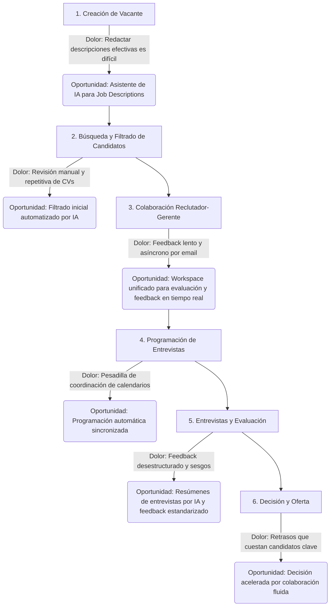
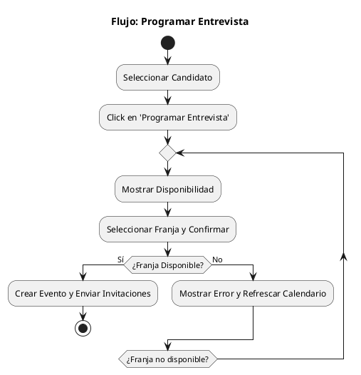
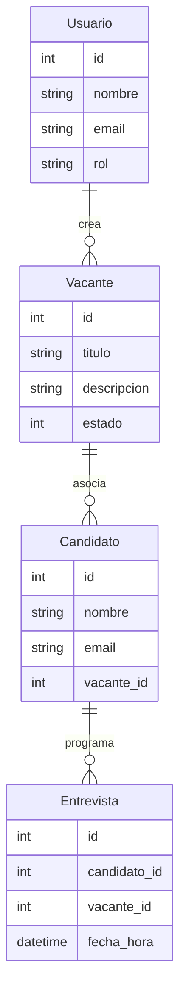

# Paquete de Descubrimiento de Inicio: LTI - El ATS Inteligente

*Última Actualización: 2025-06-18*

### Resumen Ejecutivo
LTI es un Sistema de Seguimiento de Candidatos (ATS) diseñado para actuar como el "copiloto" de los equipos de reclutamiento modernos. El problema central es que los ATS actuales son sistemas pasivos que generan fricción, ralentizan los procesos y provocan la pérdida de talento clave. LTI resuelve esto mediante una plataforma que integra colaboración en tiempo real entre reclutadores y gerentes, automatización inteligente de tareas repetitivas y una capa de IA que asiste activamente en la toma de decisiones. La oportunidad de mercado reside en capturar a las empresas tecnológicas en crecimiento, un segmento que valora la agilidad y la eficiencia, ofreciendo una experiencia de usuario y una utilidad predictiva muy superiores a las de los sistemas heredados.

### Propuesta de Valor Clave
*   **Contratación Acelerada:** Reduce drásticamente el tiempo para cubrir una vacante automatizando tareas manuales y agilizando la toma de decisiones.
*   **Colaboración sin Fricciones:** Elimina los silos de comunicación con espacios de trabajo unificados que sincronizan a reclutadores y gerentes.
*   **Decisiones más Inteligentes:** Transforma datos en estrategia con IA que sugiere los mejores candidatos y optimiza la descripción de puestos.
*   **Experiencia Superior:** Ofrece una interfaz intuitiva y una experiencia fluida que deleita tanto a los equipos de contratación como a los candidatos.

---

## Artefacto 1: Product Vision Board

| **Componente** | **Descripción** |
| :--- | :--- |
| **Visión** | Transformar el proceso de contratación, de una tarea administrativa a una experiencia fluida, colaborativa y predictiva que equipos y candidatos adoren. |
| **Grupo Objetivo** | Reclutadores, equipos de RRHH y Gerentes de Contratación en empresas tecnológicas en crecimiento (startups y scaleups). |
| **Necesidades / Problema** | Los ATS actuales son lentos, torpes, aíslan la comunicación, carecen de automatización inteligente y provocan la pérdida de talento valioso. |
| **Producto / Solución** | Un ATS inteligente con espacios de colaboración en tiempo real, automatización de programación y filtrado, y un asistente de IA proactivo. |
| **Valor / Business Goals** | **Adquisición:** Aumentar la tasa de conversión de candidatos. **Retención:** Mejorar la satisfacción del equipo de contratación. **Eficiencia:** Reducir el tiempo para contratar (Time-to-Hire). |

---

## Artefacto 2: Domain Process Map & Pain Points



---

## Artefacto 3: Lean Canvas

| **Problema** | **Solución** | **Propuesta Única de Valor** | **Ventaja Injusta** | **Segmentos de Cliente** |
| :--- | :--- | :--- | :--- | :--- |
| 1. Procesos de contratación lentos e ineficientes.<br>2. Pobre colaboración entre reclutadores y gerentes.<br>3. Pérdida de talento clave frente a competidores ágiles. | 1. Workspaces de colaboración por vacante.<br>2. Programación de entrevistas automatizada.<br>3. Filtrado de CVs asistido por IA. | El primer ATS que actúa como un "copiloto" para los equipos de contratación, haciendo el reclutamiento más rápido, inteligente y colaborativo. | Modelos de IA propietarios entrenados con patrones de contratación exitosos y una experiencia de usuario radicalmente intuitiva. | **Adoptantes Tempranos:** Startups y scaleups de tecnología (50-500 empleados) con un alto volumen de contratación. |
| **Métricas Clave** | **Canales** |
| 1. Tiempo para contratar (Time-to-Hire).<br>2. Tasa de activación de usuarios (reclutadores y gerentes).<br>3. Tasa de conversión de prueba a pago. | 1. Marketing de contenidos (blogs, webinars).<br>2. Ventas directas enfocadas.<br>3. Alianzas con VCs y comunidades tecnológicas. |
| **Estructura de Costos** | **Flujo de Ingresos** |
| Salarios (Desarrollo, Ventas, Soporte), Infraestructura Cloud (hosting, cómputo de IA), Marketing y Ventas. | Modelo de suscripción SaaS por niveles (basado en número de usuarios o vacantes activas). |

---

## Artefacto 4: Análisis Competitivo y Estrategia de Ataque

El mercado de ATS cuenta con jugadores establecidos como Greenhouse, Lever y Workday, que son potentes pero a menudo percibidos como sistemas de registro complejos y no como herramientas de colaboración ágil. Su enfoque en grandes empresas ha dejado un hueco en el segmento de startups y scaleups que priorizan la velocidad y la experiencia de usuario.

**Tabla Comparativa**

| Característica | LTI | Greenhouse | Lever | Workday |
| :--- | :---: | :---: | :---: | :---: |
| **Experiencia de Usuario (UX) Intuitiva** | ✅ | ❌ | ✅ | ❌ |
| **Colaboración en Tiempo Real** | ✅ | ❌ | ❌ | ❌ |
| **Filtrado Inteligente (IA)** | ✅ | ✅ | ✅ | ❌ |
| **Análisis de Entrevistas (IA)** | ✅ | ❌ | ❌ | ❌ |
| **Enfoque en Scaleups** | ✅ | ❌ | ✅ | ❌ |

**Análisis de Debilidades y Oportunidades**
La principal debilidad de la competencia es su deuda técnica y de producto; están construidos sobre un paradigma anticuado. Esto se manifiesta en una UX a menudo torpe, flujos de colaboración fragmentados que dependen de integraciones externas y un uso de la IA limitado a la concordancia de palabras clave. La oportunidad para LTI es posicionarse como la solución nativa para la forma en que los equipos modernos quieren trabajar: de forma colaborativa, rápida y basada en datos.

**Estrategia de Ataque Recomendada**
Nuestra hipótesis estratégica es penetrar el mercado a través de un **enfoque obsesivo en la colaboración y la experiencia de usuario**, dirigido al segmento de scaleups tecnológicas. La estrategia será de "product-led growth": ofrecer un modelo de prueba o freemium que permita a los equipos experimentar el valor de la colaboración instantáneamente. Esto creará un efecto de "caballo de Troya" donde los gerentes de contratación, encantados con la experiencia, impulsarán la adopción en toda la organización, un canal que los incumbentes, con sus largos ciclos de venta, no pueden replicar fácilmente.

---

## Artefacto 5: Suposiciones Críticas y Métricas de Éxito

**Tabla de Suposiciones Críticas**

| Suposición | Método de Validación (MVP) |
| :--- | :--- |
| 1. Los gerentes de contratación adoptarán activamente una nueva herramienta si mejora la colaboración y les ahorra tiempo. | Medir la tasa de adopción y engagement semanal de los gerentes invitados. Realizar entrevistas cualitativas para validar la percepción de valor. |
| 2. Nuestra IA puede ofrecer sugerencias de candidatos significativamente mejores que el filtrado manual o por palabras clave. | Realizar pruebas A/B comparando la tasa de avance en el funnel de candidatos sugeridos por IA vs. los seleccionados manualmente. |
| 3. Los equipos están dispuestos a pagar por una UX superior y funciones de colaboración, incluso si existen opciones más baratas. | Probar diferentes puntos de precio y medir la tasa de conversión de prueba a plan de pago. |

**Tabla de Métricas de Éxito (KPIs)**

| KPI | Objetivo Inicial | Justificación |
| :--- | :--- | :--- |
| **Reducción del Tiempo para Contratar** | Disminuir en un 25% en los primeros 6 meses de uso. | Valida la promesa central de eficiencia y velocidad. |
| **Tasa de Usuarios Activos Semanales (WAU)** | > 70% para reclutadores y gerentes invitados. | Demuestra que LTI se ha convertido en una herramienta de trabajo indispensable y no en un sistema que se usa esporádicamente. |
| **Net Promoter Score (NPS)** | > 50 | Mide la satisfacción y el "amor" por el producto, validando la visión de crear una experiencia que los usuarios adoren. |

---

## Plan de Acción de UX: LTI

### Artefacto 1: Resumen de Hallazgos de Investigación

1.  **La Fricción en la Colaboración es el Principal Cuello de Botella:** El mayor punto de dolor no es la falta de funciones, sino la brecha de comunicación entre reclutadores y gerentes de contratación. Las decisiones se retrasan y el contexto se pierde en hilos de correo electrónico, lo que ralentiza directamente el "Time-to-Hire".
2.  **La Sobrecarga de Tareas de Bajo Valor es Universal:** Ambos perfiles de usuario están frustrados por tareas administrativas y repetitivas (filtrado de CVs, coordinación de calendarios) que les impiden centrarse en el trabajo estratégico de alto valor, como evaluar la idoneidad cultural o vender la visión de la empresa a los candidatos.
3.  **La Velocidad es la Métrica Definitiva para el Éxito:** Para las scaleups, perder a un candidato clave por un proceso lento no es una simple molestia, es una desventaja competitiva. La eficiencia y la agilidad del proceso de contratación son, por tanto, un objetivo de negocio crítico.
4.  **La Experiencia de Usuario es la Ventaja Competitiva:** La oportunidad de LTI no reside en añadir más funciones, sino en ofrecer una experiencia radicalmente más simple, intuitiva y colaborativa que la de los sistemas heredados. La UX no es un extra, es la propuesta de valor central.

### Artefacto 2: Arquetipos de Usuario (Personas)

| Arquetipo | Foto/Emoji | Objetivos Clave | Dolores y Frustraciones | Motivaciones | Cita Clave |
| :--- | :---: | :--- | :--- | :--- | :--- |
| **Elena, la Reclutadora Eficiente** | 👩‍💻 | 1. Cubrir vacantes rápidamente con talento de calidad.<br>2. Ser una socia estratégica para los gerentes.<br>3. Mejorar la experiencia del candidato. | - Interminables idas y venidas por email para feedback y calendarios.<br>- Presión constante para reducir el "Time-to-Hire".<br>- Perder candidatos por procesos lentos. | - Alcanzar los objetivos de contratación.<br>- Construir un equipo y una cultura sólidos.<br>- Ver el éxito de los candidatos que ha contratado. | "Me siento más como una administradora que como una socia de talento. Si pudiera tener a todos en la misma página, nos moveríamos mucho más rápido." |
| **David, el Gerente de Ingeniería Ocupado** | 👨‍🚀 | 1. Construir un equipo de alto rendimiento.<br>2. Contratar a la persona adecuada con una mínima interrupción de su trabajo.<br>3. Tomar una decisión de contratación informada. | - Revisar CVs irrelevantes.<br>- Cambiar de contexto constantemente entre su trabajo y el ATS.<br>- Entrevistas que se sienten como una pérdida de tiempo.<br>- Poca visibilidad del pipeline. | - Encontrar a alguien que pueda contribuir desde el primer día.<br>- Reducir el tiempo que su equipo está con personal insuficiente.<br>- Sentir confianza en su decisión de contratación. | "No tengo tiempo para aprender un sistema complejo. Solo muéstrame los mejores candidatos y déjame dar mi opinión rápidamente para poder volver con mi equipo." |

### Artefacto 3: Jobs-to-be-Done (JTBD) Clave

1.  **Alineación:** "Cuando se abre una nueva vacante, quiero **alinearme rápidamente con el equipo de contratación** sobre cómo es un gran candidato, para poder **movernos con decisión y atraer al talento adecuado** desde el principio."
2.  **Decisión:** "Cuando estoy evaluando candidatos, quiero **ver toda la información relevante y el feedback del equipo en un solo lugar**, para poder **tomar una decisión segura y objetiva** sin tener que perseguir a la gente para conocer sus opiniones."
3.  **Desbloqueo:** "Cuando el proceso de contratación se estanca, quiero **identificar y resolver el cuello de botella al instante**, para **no perder a nuestros mejores candidatos** frente a competidores más rápidos."

### Artefacto 4: User Story Map

*   **Actividad 1: Configurar y Poblar la Vacante**
    *   Tarea: Crear el espacio de trabajo
        *   US-001: Como Reclutador, quiero crear una vacante y configurar el equipo de contratación para centralizar la comunicación.
    *   Tarea: Añadir candidatos
        *   US-002: Como Reclutador, quiero añadir candidatos a la vacante para que el equipo pueda evaluarlos.
*   **Actividad 2: Evaluar Candidatos en Equipo**
    *   Tarea: Revisar perfiles y dar feedback
        *   US-003: Como miembro del equipo, quiero ver los perfiles de los candidatos en un pipeline visual simple.
        *   US-004: Como miembro del equipo, quiero dejar comentarios y una calificación en el perfil de cada candidato para compartir mi evaluación.
        *   US-005: Como Reclutador, quiero ver todo el feedback consolidado para tomar una decisión informada.
        *   US-006: Como miembro del equipo, quiero recibir una notificación cuando se requiera mi feedback para no ser un cuello de botella.
*   **Actividad 3: Coordinar Siguientes Pasos**
    *   Tarea: Programar entrevistas
        *   US-007: Como Reclutador, quiero que el sistema me ayude a programar entrevistas sincronizando los calendarios de los participantes.
---
*   **Actividad 4: Optimizar con IA**
    *   Tarea: Acelerar el filtrado
        *   US-008: Como Reclutador, quiero que la IA filtre y clasifique automáticamente a los nuevos candidatos para enfocarme en los más relevantes.
    *   Tarea: Mejorar la calidad de la vacante
        *   US-009: Como Reclutador, quiero usar un asistente de IA para generar una descripción del puesto optimizada.

### Artefacto 5: Backlog del MVP (Release 1)

| ID | Historia de Usuario | Criterios de Aceptación (Gherkin) | Prioridad | Impacto | Esfuerzo Estimado |
| :--- | :--- | :--- | :--- | :--- | :--- |
| **US-001** | Como Reclutador, quiero crear una vacante y configurar el equipo de contratación para centralizar la comunicación. | **Dado** que soy un Reclutador,<br>**Cuando** creo una nueva vacante,<br>**Entonces** se genera un espacio de trabajo único y puedo invitar a los miembros del equipo. | Must-have | Alto | Medio |
| **US-002** | Como Reclutador, quiero añadir candidatos a la vacante para que el equipo pueda evaluarlos. | **Dado** que estoy en el espacio de trabajo de una vacante,<br>**Cuando** añado un candidato,<br>**Entonces** este aparece en la primera etapa del pipeline. | Must-have | Alto | Bajo |
| **US-003** | Como miembro del equipo, quiero ver los perfiles de los candidatos en un pipeline visual simple. | **Dado** que estoy en un espacio de trabajo,<br>**Cuando** veo a los candidatos,<br>**Entonces** se muestran en columnas que representan las etapas del proceso. | Must-have | Alto | Medio |
| **US-004** | Como miembro del equipo, quiero dejar comentarios y una calificación en el perfil de cada candidato para compartir mi evaluación. | **Dado** que estoy viendo el perfil de un candidato,<br>**Cuando** añado un comentario y una calificación,<br>**Entonces** mi feedback queda guardado y visible para el equipo. | Must-have | Alto | Bajo |
| **US-005** | Como Reclutador, quiero ver todo el feedback consolidado para tomar una decisión informada. | **Dado** que estoy viendo el perfil de un candidato,<br>**Cuando** abro la sección de feedback,<br>**Entonces** veo una lista cronológica de todos los comentarios y calificaciones. | Must-have | Alto | Bajo |
| **US-006** | Como miembro del equipo, quiero recibir una notificación cuando se requiera mi feedback para no ser un cuello de botella. | **Dado** que un Reclutador ha solicitado mi feedback,<br>**Cuando** inicio sesión,<br>**Entonces** veo una notificación que me lleva al candidato que necesita mi atención. | Must-have | Medio | Medio |
| **US-007** | Como Reclutador, quiero que el sistema me ayude a programar entrevistas sincronizando los calendarios de los participantes. | **Dado** que hemos decidido entrevistar a un candidato,<br>**Cuando** inicio la programación,<br>**Entonces** puedo seleccionar a los entrevistadores y ver sus disponibilidades. | Should-have | Alto | Alto |

### Artefacto 6: Checklist de Validación de Dominio y UX

- [ ] **Flujo Unificado:** ¿Puede un reclutador y un gerente completar el ciclo de evaluación de un candidato sin salir de la plataforma o recurrir al correo electrónico?
- [ ] **Claridad de la Tarea:** ¿Entiende un gerente de contratación qué se espera de él en menos de 30 segundos después de iniciar sesión?
- [ ] **Carga Cognitiva Mínima:** ¿La interfaz presenta solo la información necesaria para la tarea en cuestión, evitando abrumar al usuario?
- [ ] **Feedback Inmediato:** ¿El sistema proporciona retroalimentación instantánea después de que un usuario completa una acción clave (ej: "Feedback guardado")?
- [ ] **Consistencia:** ¿Se utilizan los mismos patrones de diseño y terminología en todo el flujo de trabajo?
- [ ] **Rendimiento:** ¿La plataforma se siente rápida y receptiva, especialmente al cargar perfiles de candidatos y feedback?
- [ ] **Accesibilidad:** ¿El diseño cumple con los estándares básicos de accesibilidad ([WCAG 2.1](https://www.w3.org/TR/WCAG21/)) como contraste de color y navegación por teclado?

---

## Roadmap de Producto Estratégico

### Artefacto 1: Resumen Estratégico del Roadmap

El enfoque principal de LTI en esta etapa inicial es resolver el problema crítico de la colaboración ineficiente entre reclutadores y gerentes de contratación. El MVP se centra en proporcionar un flujo de trabajo unificado que permita a los equipos gestionar vacantes y candidatos de manera eficiente, reduciendo el "Time-to-Hire" y mejorando la experiencia del usuario. A través de este MVP, esperamos validar la adopción inicial y aprender cómo los usuarios interactúan con las funcionalidades clave, como el pipeline visual y el feedback consolidado.

A medida que avanzamos, el objetivo será optimizar el proceso de búsqueda y filtrado de candidatos, así como integrar herramientas que automaticen tareas repetitivas, como la programación de entrevistas. En el futuro, planeamos expandir las capacidades del producto con analíticas avanzadas y módulos de IA más sofisticados para maximizar el impacto en la toma de decisiones.

### Artefacto 2: Roadmap de Producto (Now/Next/Later)

#### Now (Este Trimestre / MVP Release 1)
*   **Iniciativa:** 🚀 **Lanzamiento del Proceso de Gestión de Ofertas y Candidatos**
    *   **Resultado Clave Esperado:** Permitir a los reclutadores gestionar el ciclo de vida básico de una oferta, desde la creación hasta la recepción de candidatos.
    *   **KPIs Impactados:** Tasa de Adopción Inicial, Nº de Ofertas Creadas.
    *   **JTBD/Persona Principal:** Elena (Reclutadora).
*   **Iniciativa:** 📋 **Consolidación de Feedback y Decisiones**
    *   **Resultado Clave Esperado:** Facilitar la toma de decisiones informadas mediante un espacio centralizado para el feedback del equipo.
    *   **KPIs Impactados:** Tiempo para Contratar, Satisfacción del Usuario.
    *   **JTBD/Persona Principal:** David (Gerente de Ingeniería).

#### Next (Próximo Trimestre)
*   **Iniciativa:** 🔍 **Optimización de la Búsqueda y Filtrado de Candidatos**
    *   **Resultado Clave Esperado:** Reducir en un 50% el tiempo que tardan los reclutadores en encontrar candidatos relevantes.
    *   **KPIs Impactados:** Tiempo en Tarea, Satisfacción del Usuario.
    *   **JTBD/Persona Principal:** Elena (Reclutadora).
*   **Iniciativa:** 📅 **Integración con Calendarios Externos**
    *   **Resultado Clave Esperado:** Simplificar la programación de entrevistas, eliminando la coordinación manual.
    *   **KPIs Impactados:** Tasa de Finalización de Tarea (Programar Entrevista).
    *   **JTBD/Persona Principal:** Elena (Reclutadora).

#### Later (Futuro)
*   **Iniciativa:** 📊 **Módulo Básico de Analíticas y Reportes**
    *   **Resultado Clave Esperado:** Ofrecer a los managers de RRHH visibilidad sobre la eficiencia de sus procesos de contratación.
    *   **KPIs Impactados:** Tasa de Conversión de Candidatos, Tiempo para Contratar.
    *   **JTBD/Persona Principal:** David (Gerente de Ingeniería).
*   **Iniciativa:** 🤖 **Automatización Avanzada con IA**
    *   **Resultado Clave Esperado:** Proveer recomendaciones predictivas y análisis de entrevistas para mejorar la calidad de las contrataciones.
    *   **KPIs Impactados:** Calidad de Contratación, Satisfacción del Usuario.
    *   **JTBD/Persona Principal:** Elena (Reclutadora).

---

## Documento de Diseño de Solución

### Artefacto 1: Casos de Uso Críticos Detallados

#### Caso de Uso: Programar Entrevista

| Campo | Descripción |
| :---- | :---- |
| **ID** | CU-001 |
| **Historia de Usuario Asociada** | Como Reclutador, quiero que el sistema me ayude a programar entrevistas sincronizando los calendarios de los participantes. |
| **Actor Principal** | Elena (Reclutadora) |
| **Descripción Breve** | Este caso de uso describe cómo un reclutador programa una entrevista con un candidato y un entrevistador. |
| **Precondiciones** | 1. El actor está autenticado en el sistema.<br>2. Existe una oferta de empleo activa.<br>3. El candidato ha sido asociado a la oferta. |
| **Postcondiciones (Éxito)** | 1. Se crea un evento de entrevista en el sistema.<br>2. Se envía una invitación por calendario al candidato y al entrevistador.<br>3. El estado del candidato en la oferta se actualiza a "Entrevista Programada". |

**Flujo Principal (Happy Path):**
1. El actor selecciona al candidato dentro de una oferta de empleo.
2. El actor hace clic en la opción "Programar Entrevista".
3. El sistema muestra la disponibilidad combinada de los calendarios del candidato y los entrevistadores asociados.
4. El actor selecciona una franja horaria disponible, especifica el tipo de entrevista y confirma.
5. El sistema valida que la franja sigue libre y crea el evento.
6. El sistema envía las invitaciones y actualiza el estado del candidato.

**Flujos Alternativos:**
1. **(En el paso 5) La franja horaria seleccionada ya no está disponible:** El sistema muestra un mensaje de error y refresca la vista de calendarios para mostrar la disponibilidad actualizada.

**Diagrama de Actividad (UML):**


### Artefacto 2: Arquitectura de Alto Nivel (Modelo C4: C1, C2 y C3)

#### Diagrama C1 - Contexto del Sistema
```plantuml
@startuml
!include C4-PlantUML/C4_Context.puml
Person(recruiter, "Reclutador")
Person(hiring_manager, "Gerente de Contratación")
System(ats, "LTI - ATS Inteligente", "Sistema de Gestión de Candidatos")

recruiter -> ats : Gestionar Vacantes y Candidatos
hiring_manager -> ats : Colaborar en Evaluaciones
@enduml
```

#### Diagrama C2 - Contenedores
```plantuml
@startuml
!include C4-PlantUML/C4_Container.puml
System_Boundary(ats, "LTI - ATS Inteligente") {
  Container(web_app, "Aplicación Web", "React", "Interfaz para usuarios finales")
  Container(api, "API REST", "Node.js", "Lógica de negocio y exposición de servicios")
  ContainerDb(database, "Base de Datos", "PostgreSQL", "Almacén de datos persistentes")
}

web_app -> api : Solicitudes de Usuario
api -> database : Consultas y Actualizaciones
@enduml
```

#### Diagrama C3 - Componentes
```plantuml
@startuml
!include C4-PlantUML/C4_Component.puml
Container_Boundary(api, "API REST") {
  Component(auth_controller, "Controlador de Autenticación", "Node.js", "Gestión de usuarios y sesiones")
  Component(interview_service, "Servicio de Entrevistas", "Node.js", "Lógica para programar entrevistas")
  Component(candidate_repo, "Repositorio de Candidatos", "Node.js", "Acceso a datos de candidatos")
}

auth_controller -> interview_service : Validar Usuario
interview_service -> candidate_repo : Obtener Datos del Candidato
@enduml
```

### Artefacto 3: Modelo de Datos Conceptual (ERD)


### Artefacto 4: Requisitos No Funcionales (NFRs) Clave

| Categoría | Requisito Específico | Criterio de Aceptación |
| :--- | :--- | :--- |
| Rendimiento | La carga de la página principal debe ser rápida. | El LCP (Largest Contentful Paint) debe ser < 2.5 segundos. |
| Seguridad | Las contraseñas de los usuarios deben estar almacenadas de forma segura. | Las contraseñas deben estar hasheadas y salteadas usando bcrypt. |
| Usabilidad | La interfaz debe ser intuitiva para usuarios no técnicos. | El 90% de los usuarios deben completar tareas clave sin asistencia en pruebas de usabilidad. |
| Escalabilidad | El sistema debe soportar hasta 10,000 usuarios concurrentes. | Pruebas de carga deben demostrar este nivel de concurrencia sin degradación significativa. |

### Artefacto 5: Registro de Decisiones de Arquitectura (ADR)

#### ADR-001: Elección de PostgreSQL como Base de Datos Relacional

**Estado:** Aceptado

**Contexto:**
El sistema requiere una base de datos que soporte transacciones ACID, consultas complejas y escalabilidad moderada para manejar datos estructurados como usuarios, vacantes y entrevistas.

**Decisión:**
Se eligió PostgreSQL debido a su robustez, soporte para extensiones avanzadas y una comunidad activa que asegura soporte a largo plazo.

**Consecuencias:**
* **Positivas:**
  * Consultas complejas y transacciones seguras.
  * Escalabilidad vertical y horizontal moderada.
* **Negativas:**
  * Curva de aprendizaje para desarrolladores no familiarizados con PostgreSQL.
